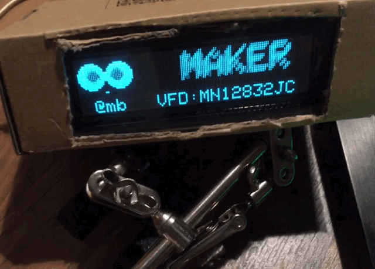

# AdafruitGFX lib compatible driver for an MN12832JC VFD display.



Works with TeensyLC, could be possible on Arduinos too, displayRefresh is called via IntervalTimer, which is Teensy only.

Just mind the signal level gap, the display runs on 5V. Use a level shifter or bring down VDD1 to ~4.3V (diode), high is specified as 80% of VDD1. When turning down VDD1 the display will transition from eratic to clean :-) .

<a href="https://www.buymeacoffee.com/mariosgeu" target="_blank"></a>

### Dependencies:

Adafruit_GFX - may be required as a dependency. On Teensy it is included in the framework.

platformio.ini
```
lib_deps = 
    adafruit/Adafruit GFX Library@^1.11.9
```

### Pinout, Connections

- These are hardcoded, see mbGFX_MN12832JC.cpp

## Todo:

### Pins

Add pin def to constructor !

### DMA

DMASPI: https://github.com/crteensy/DmaSpi

adds some defines.. https://github.com/Blackaddr/DmaSpi

